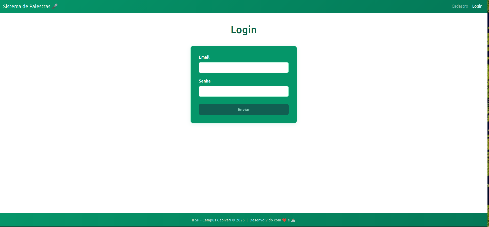

# Sistema de Palestras

Aplicação web fullstack para gerenciamento de eventos e palestras, com cadastro de usuários, autenticação segura e inscrições em eventos.




---

## Tecnologias utilizadas

| Camada | Tecnologia |
|---|---|
| Frontend | Angular 21 + Bootstrap 5 |
| Backend | Node.js + Express 5 |
| Banco de dados | MySQL / MariaDB |
| Criptografia | bcrypt |

---

## Estrutura do projeto

```
sistemaPalestras/
├── server/
│   ├── server.js       # API REST com todas as rotas do backend
│   └── db.js           # Configuração da conexão com o banco de dados
├── src/
│   ├── app/
│   │   ├── auth.ts               # Serviço de autenticação (sessão do usuário)
│   │   ├── app.routes.ts         # Definição das rotas do Angular
│   │   ├── cadastro/             # Tela e lógica de cadastro de usuário
│   │   ├── login/                # Tela e lógica de login
│   │   ├── home/                 # Tela inicial com listagem de palestras
│   │   └── cadastrar-evento/     # Tela de cadastro de eventos (admin)
│   ├── index.html
│   ├── main.ts
│   └── styles.css
├── package.json
└── angular.json
```

---

## Configuração do banco de dados

Crie o banco e as tabelas executando o SQL abaixo no seu MySQL/MariaDB:

```sql
CREATE DATABASE IF NOT EXISTS palestras;
USE palestras;

CREATE TABLE IF NOT EXISTS usuarios (
    ID     INT          PRIMARY KEY AUTO_INCREMENT,
    email  VARCHAR(255),
    nome   VARCHAR(255),
    senha  VARCHAR(255),  -- armazena o hash bcrypt, nunca a senha original
    admin  BOOLEAN DEFAULT 0
);

CREATE TABLE palestra (
    id              INT          PRIMARY KEY AUTO_INCREMENT,
    titulo          VARCHAR(255),
    descricao       VARCHAR(255),
    nomePalestrante VARCHAR(255),
    localEvento     VARCHAR(255),
    dataEvento      TIMESTAMP
);

CREATE TABLE inscricoes (
    id         INT PRIMARY KEY AUTO_INCREMENT,
    idUsuario  INT,
    idPalestra INT,
    FOREIGN KEY (idUsuario)  REFERENCES usuarios(id),
    FOREIGN KEY (idPalestra) REFERENCES palestra(id),
    UNIQUE (idUsuario, idPalestra)  -- impede inscrição duplicada no mesmo evento
);
```

> A chave primária composta em `inscricoes (idUsuario, idPalestra)` é o que gera o erro `ER_DUP_ENTRY` tratado no backend quando o usuário tenta se inscrever duas vezes no mesmo evento.

---

## Como executar

### Pré-requisitos

- Node.js instalado
- MySQL ou MariaDB rodando localmente
- Banco de dados `palestras` criado

### Variáveis de ambiente

As credenciais do banco de dados são configuradas via arquivo `.env`. Um arquivo de exemplo está disponível na raiz do projeto.

**1. Copie o arquivo de exemplo:**

```bash
cp .env.example .env
```

**2. Edite o `.env` e preencha com suas credenciais:**

```env
DB_HOST=localhost
DB_USER=root
DB_PASSWORD=sua_senha_aqui
DB_NAME=palestras
```

### Instalação

```bash
npm install
```

### Iniciando o projeto

```bash
npm start
```

Esse comando inicia simultaneamente o servidor Node.js (porta 3000) e o frontend Angular (porta 4200).

Após iniciado, acesse a aplicação em: **http://localhost:4200**

---

## Rotas da API

| Método | Rota | Descrição |
|---|---|---|
| `POST` | `/api/cadastro` | Cadastra um novo usuário |
| `POST` | `/api/login` | Autentica um usuário |
| `GET` | `/api/palestras` | Lista todas as palestras com total de inscritos |
| `POST` | `/api/admin` | Cadastra um novo evento (admin) |
| `POST` | `/api/inscricao` | Inscreve um usuário em uma palestra |
| `PUT` | `/api/palestra/:id` | Atualiza dados de uma palestra |
| `DELETE` | `/api/palestra/:id` | Remove uma palestra e suas inscrições |

---

## Rotas do frontend

| Rota | Componente | Descrição |
|---|---|---|
| `/home` | `Home` | Listagem de palestras disponíveis |
| `/cadastro` | `Cadastro` | Formulário de cadastro de usuário |
| `/login` | `Login` | Formulário de login |
| `/admin` | `CadastrarEvento` | Cadastro de novos eventos |

---

## Criptografia de senhas

A segurança das senhas foi implementada com a biblioteca **bcrypt**, que impede que senhas sejam armazenadas em texto puro no banco de dados.

### Como funciona o bcrypt

O bcrypt é um algoritmo de hash unidirecional. Isso significa que:

- A senha original **nunca é salva** — apenas um "código embaralhado" (hash) é armazenado.
- É **impossível reverter** o hash para descobrir a senha original.
- Cada hash gerado é **único**, mesmo que duas senhas sejam iguais, por causa do **salt** (valor aleatório adicionado antes do embaralhamento).

---

### 1. No cadastro — `server/server.js`

Quando o usuário cria uma conta, a senha digitada é transformada em hash antes de ser salva:

```js
// A senha chega em texto puro pelo formulário
const { email, nome, senha } = req.body;

// bcrypt embaralha a senha com 10 rodadas de processamento
const senhaHash = await bcrypt.hash(senha, 10);

// Apenas o hash é salvo no banco, nunca a senha original
await conexao.execute(
    'INSERT INTO usuarios (email, nome, senha) VALUES (?, ?, ?)',
    [email, nome, senhaHash]
);
```

O número `10` é o **fator de custo** (salt rounds): indica que o algoritmo será repetido 2¹⁰ = 1024 vezes, tornando ataques de força bruta muito lentos.

O hash salvo no banco tem este formato:

```
$2b$10$xYzAbCdEfGhIjKlMnOpQrOeW1234567890abcdefghijklmnopqrstu
 ↑   ↑  ↑                    ↑
versão custo  salt (22 chars)   hash da senha (31 chars)
```

---

### 2. No login — `server/server.js`

Quando o usuário tenta entrar, a senha digitada é comparada com o hash armazenado:

```js
const { email, senha } = req.body;

// Busca o usuário pelo email
const [usuario] = await conexao.execute(
    "SELECT * FROM usuarios WHERE email = ?", [email]
);

// Compara a senha digitada com o hash do banco
const senhaCorreta = await bcrypt.compare(senha, verificaUsuario.senha);

if (!senhaCorreta) {
    return res.json({ message: "Email ou senha inválidos" });
}
```

O `bcrypt.compare` extrai o salt do hash salvo, processa a senha digitada da mesma forma e verifica se os resultados coincidem — tudo isso sem nunca "desembaralhar" o hash original.

---

### 3. No frontend — `src/app/cadastro/cadastro.ts` e `login/login.ts`

O frontend **não faz nenhuma criptografia**. Ele apenas valida se os campos foram preenchidos corretamente antes de enviar os dados para o backend:

```ts
// Validação mínima de 8 caracteres antes de enviar
senha: new FormControl('', [
    Validators.required,
    Validators.minLength(8)
])
```

Toda a criptografia acontece exclusivamente no servidor, garantindo que a senha nunca seja processada no navegador.

---

### 4. Sessão do usuário — `src/app/auth.ts`

Após o login bem-sucedido, os dados do usuário (id, nome, email, admin) são salvos no `localStorage` do navegador. **A senha nunca faz parte desses dados.**

```ts
login(userData: { id: number; email: string; nome: string; admin: boolean }): void {
    localStorage.setItem(this.key, JSON.stringify(userData));
}
```

---

### Resumo do fluxo de segurança

```
CADASTRO
  Usuário digita senha
       ↓
  Frontend valida (mínimo 8 caracteres)
       ↓
  Backend recebe a senha em texto puro
       ↓
  bcrypt.hash(senha, 10) → gera hash único com salt embutido
       ↓
  Hash é salvo no banco de dados

LOGIN
  Usuário digita senha
       ↓
  Backend busca o hash no banco pelo email
       ↓
  bcrypt.compare(senhaDigitada, hashDoBanco) → true ou false
       ↓
  Acesso liberado ou negado
```
